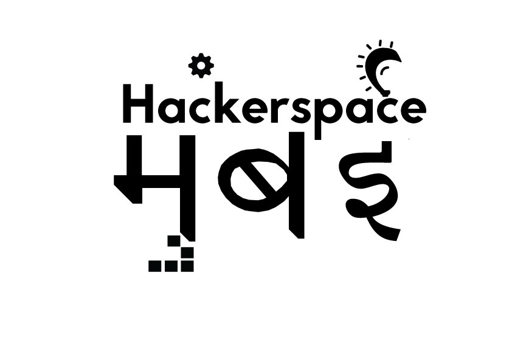

<!-- AUTO-GENERATED-CONTENT:START (STARTER) -->

  

<h1 align="center">
  Hackerspace Mumbai Blog : Technology & Community
</h1>

This blog will chronicle our journey in becoming the largest OSS community in Mumbai; sharing our learnings and experiences about technology and people !!!  

## 🎁 What we do

The mandate we have set for ourselves is to increase the knowledge level of technology at all skill levels in Mumbai, providing a platform for folks to showcase and share their knowledge and experience.

1.  **Mumbai Technology Meetup**

    A monthly meetup usually consisting of 3-4 sessions revolving around a theme. The themes for the first quarter of 2020:
    * January: Golang and Frontend Technology
    * February: IoT
    * March: DevOps

    The session is usually aimed at folks with intermediate experience but we reserve a few places for freshers.
    
1.  **Freecodecamp**

    One of our pirma   goal is to enable folks from all walks of life to be able to code and in this we found freecodecamp an ideological ally and a superlative resource. Most of our meetups have a dedicated session for folks undertaking the freeCodeCamp challenges so that they can share and encourage each other's progress towards being a full stack developer.

1.  **Protoschool**

    Being an OSS community, we believe that privacy is an inviolable right of an individual and to this end, we support and work towards a decentralized web. Along with freeCodeCamp, we host Protoschool sessions for enabling folks to take their first steps into #dWeb.

1.  **Bootcamps & Hackathons**

    If you go by last few year analytics, our most sought after events are bootcamps which comprises of day long coding sessions. These are usually theme based like cloud, #AI, #MixedReality etc. Also we partner with MLH to conduct hackathons, giving special emphasis on student participation. 

## 🙏 Our Clarion call: बिंदास, बनून टाक !!!

<!-- AUTO-GENERATED-CONTENT:END -->
