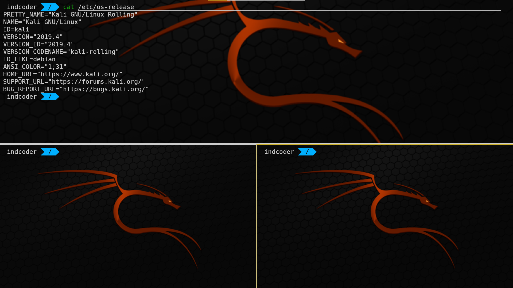
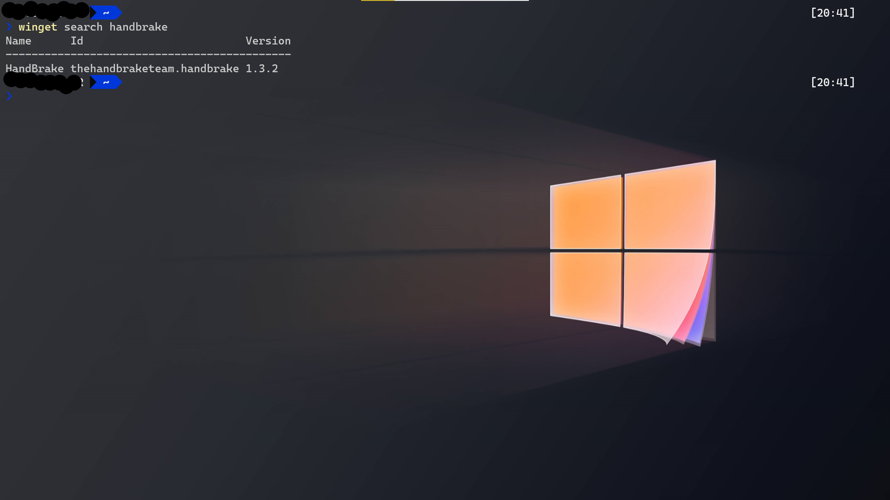

<!--StartFragment-->

While there were a lot of announcements, we are going to concentrate on the top 3 that we think WE will be using regularly.

# 1. Azure Static Web App

Procrastination in technology can be a good thing. Because sooner rather than later, most of the work that took some amount of time will be reduced to a few clicks. Case in point, we built a CD pipeline for our [Blazor WASM app in Mar 14](/blog/day-2-continuous-deployment-blazor-wasm/), which where we had to juggle with Azure pieces working together. And then lo & behold, in Build 2020, we have a shiny new toy that would automate all of this for us.

If you are deploying JAMStacks on Azure, then this [extension]() is definitely your friend.

# 2. Windows Terminal

Pop the champagne, [Windows Terminal](https://devblogs.microsoft.com/commandline/windows-terminal-1-0) has finally graduated to 1.0 where we are promised GPU accelerated rendering and from a developer productivity perspective, Tabs & Pane.

# 3. Windows Package Manager

This nicely segues into third goodie: Taking a leaf from Linux, now get your favorite Windows app via the command line.

The magic word is: [winget]

There is however a bit of blowback on this[check the comments section in the above link](https://devblogs.microsoft.com/commandline/windows-package-manager-preview)

Also other announcements that are worth a mention:

1. WSL 2 being bundled with default Windows OS
2. Project Tye. Most probably we will take a stab at this in mid-August depending on the traction it receives by then
3. Project MAUI: We would like to move our Xamarin development to VS Code [on WSL2 😁]

<!--EndFragment-->