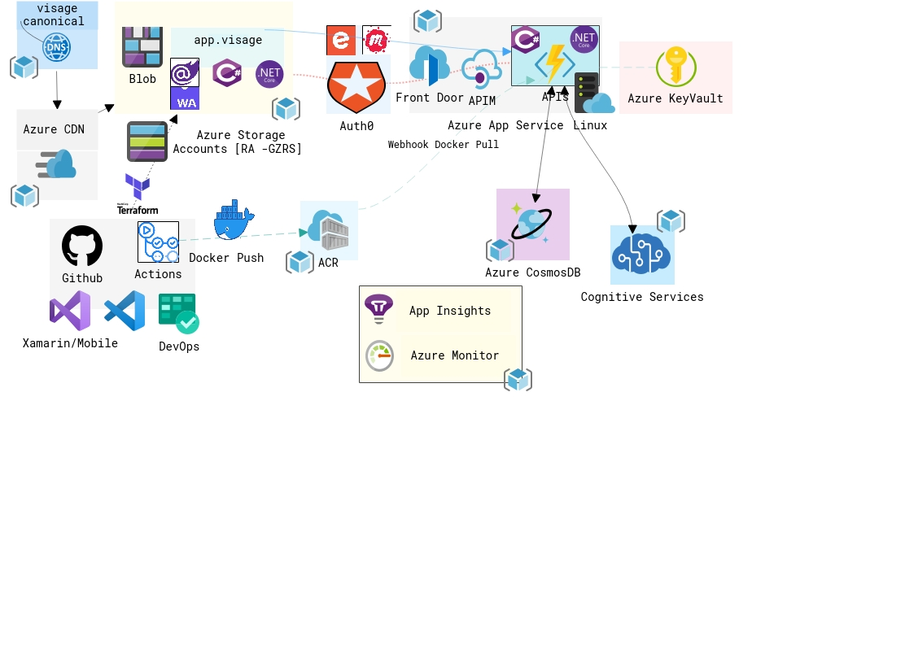

<!--StartFragment-->

As an [OSS community](fb.com/hackmum) we conduct a lot of [meetups](fb.com/mumtechup) \[last count over 100 in the past 8 years], and as an organizer one of the most important and absolutely necessary task for us \[but which most of us hate]from a civic and venue security requirements are checkins and checkouts of the attendees. 

We are building a solution where we take the opportunity to incorporate some of the latest technologies to make this contactless [#COVID19]. Think about it, the project does not need to be web scale but its much more than a hobby project; gives us quick feedback on our code (+ processes) and evaluate technologies beyond their buzz. And since our end users are tech folks, we are counting on some awesome feedback.

And as our good friend [Shaun](https://twitter.com/swyx/status/1212439325104726018) has exhorted,#LearningInTheOpen; we will blog our daily progress.

Since the person who will be doing the bulk of the work is a Docker Community Leader 🐋, a Microsoft MVP with Azure credits 💲💲💲 and an Auth0 Ambassador⭐, we will be boot strapping the solution with the following stack:

* Dev Infra: WSL2 with Visual Studio Code - Insider version
* Framework : .Net Core 3.1 on Linux
* Frontend: Blazor WASM + SignalR + Xamarin With Blazor Bindings + TailwindCSS
* Middleware: Azure Functions Containers - Docker
* Backend: CosmosDB + Neo4j
* AI/ML : Azure Cognitive Vision + Bot Service Framework
* Project: Azure DevOps
* Deployment: Azure CDN + Azure FrontDoor
* Identity: Auth0
* IoT : MXChip IoT Devkit 

The endeavour is to develop code ready to demo on technologies topical to our monthly #mumtechup [our monthly meetups usually have a theme join us for our [1st meetup for 2020](https://twitter.com/hackmum/status/1222455069964005376) ]

<!--EndFragment-->