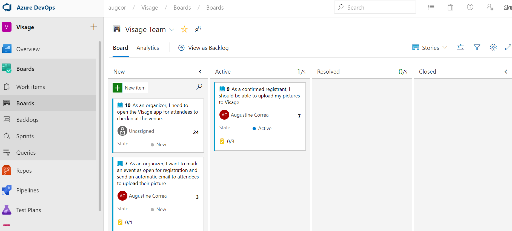
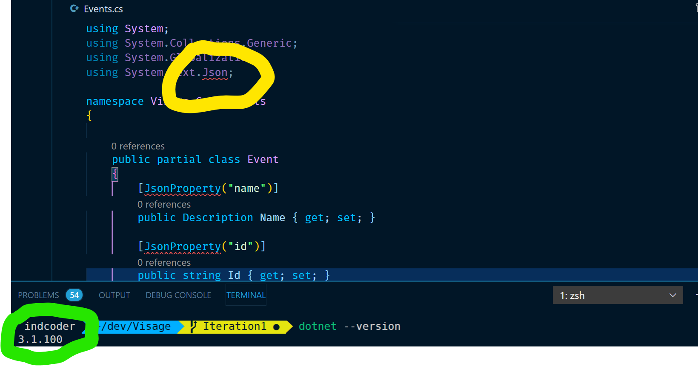
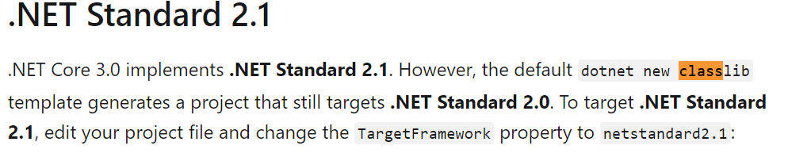

<!--StartFragment-->

We created a Azure DevOps for Requirements & Resource tracking:

<https://dev.azure.com/augcor/Visage>




The first project we created was a Visage.Core Class Library\[there is a reason we have bolden this...read further] project to hold all the models that will be used throughout the project


Our initial thinking was to annotate this with JSON property so that we can typecast the JSON responses from API calls to 3rd party APIs without creating additional classes.

But we were getting this weird error

System.Text.Json was not available even though almost all.Net Core 3.1 literature on the web were screaming out that its bundled with SDK



But after wracking our brains over this for close to an hour, we found this nugget of info tucked into one of the site.



<https://docs.microsoft.com/en-us/dotnet/core/whats-new/dotnet-core-3-0>


```dotnet
<Project Sdk="Microsoft.NET.Sdk">
<PropertyGroup>

<TargetFramework>netstandard2.1</TargetFramework>

</PropertyGroup>
</Project>
```
Why in the Scott's name such discrepancies exist between Project Types. Wasn't .Net Core 3.1 supposed to begin on a clean slate and be the "standard"? This will only trip newbies, hitting the adoption of .Net


Finally this worked, had to explicitly change it to .Net Core 3.1

```dotnet
<ProjectSdk="Microsoft.NET.Sdk">

<PropertyGroup>

<TargetFramework>netcoreapp3.1</TargetFramework>

</PropertyGroup>

</Project>
```
<!--EndFragment-->
