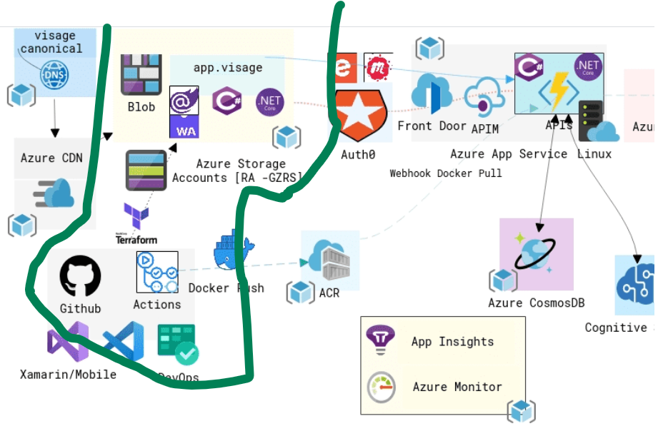
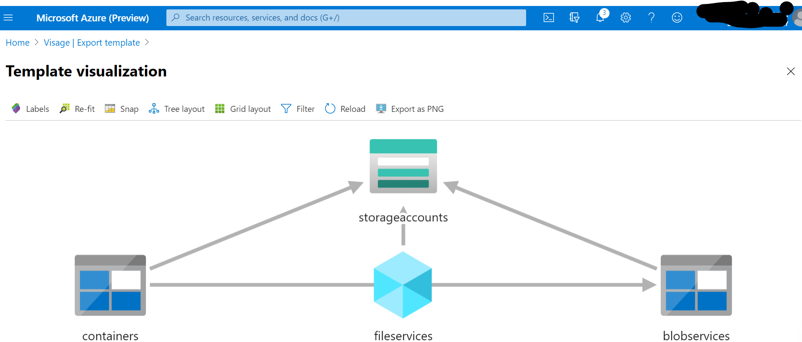

<!--StartFragment-->

Its always a good idea to get code promotion going from developer workstation onto production right at the start of the project

1. Ensures your ***DevOps*** processes are in order
2. Validates your infrastructure decision upfront when its much easier to make any changes

So for today we will implement the below part of the *Visage* architecture [highlighted in green except for the Terraform part]

As part of Continous Delivery, we will be deploying the Blazor WASM front end onto Azure Storage via GitHub Actions as soon as the code is merged onto the master branch. And Tim Heuer has a great [blog post](https://timheuer.com/blog/deploy-blazor-app-to-azure-using-github-actions/) on achieving just that.

Not going to lie....it did take quite a [few attempts](https://github.com/indcoder/Visage/actions) to get it to work.

Also came across a great ARM visualizer built by [Ben Coleman](https://twitter.com/BenCodeGeek/status/1248272453509484550) that is now incorporated as part [RC version of the Azure portal](https://rc.portal.azure.com/)

As we build other parts of the project, hopefully the above diagram will resemble the Visage architecture diagram

<!--EndFragment-->
