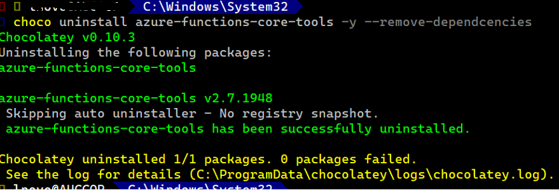
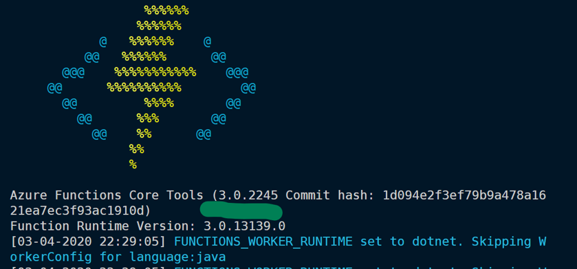
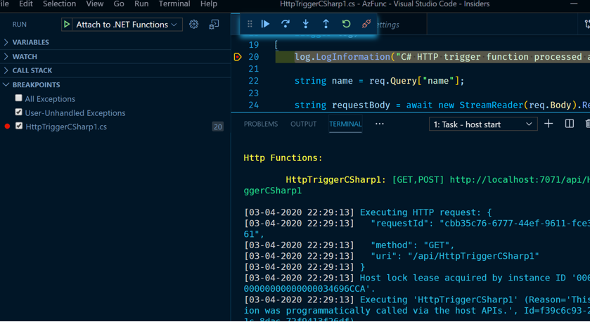

## Upgrading to Azure Function v3

Trying to kick the development tyres on the project so to speak, for that we had to bump up our dotnet version from a mix of .net 2.2 & .net core 3.0 to .net core 3.1 and we followed [Jeff Holan's Dev post](https://dev.to/azure/develop-azure-functions-using-net-core-3-0-gcm) to upgrade our Azure Functions project which is surmarised as below.

>To change a project between ~2 and ~3 locally, update the .csproj file of the project and change: AzureFunctionsVersion from v2 to v3 Microsoft.NET.Sdk.Functions package version to at least 3.0.1 Optionally, you can change to target netcoreapp3.1 if you want to target the latest .NET Core version

[But it failed?](https://stackoverflow.com/questions/61035606/azure-function-fails-to-build-when-tfm-is-upgraded-from-netcoreapp3-0-to-netcore)

On doing a full project search, we found that VS Code itself stored [i.e. in its .vscode directory], namely in two files: settings.json and tasks.json. Some config key value pairs still pointed to .net core 3.0 [perhaps these were added during when we were debugging the project when these were the current framework]. So for the migration from 2.2/3.0 to 3.1 we need to to ensure the references to the older frameworks are removed

But then we confronted with another issue:

While debugging (F5) in VS Code, the integrated terminal would should a flurry of operations under Task: Build which would be completed successfully and then even proceed to Task - host start. But instead of halting the process and providing the invocation URL, the Task-host start would silently terminate. ANd even this behaviour was not consistent because on occassion, it would "Task - host start" would actually do its job and provide the invocation URL. However the breakpoint is not hit on the invocation of the function and I see in the Breakpoints lane that it changes from a red dot to a hollow white dot and in the breakpoint pane on the debug , on hovering over the breakpoint, VS code says "No symbols have been loaded for this document"

The issue was tracked to the Azure Functions core tool. So previously when I was developing against .net core 2.2, I had downloaded v2 of the Azure Functions core tool via choco. So when I moved to .net core 3.0, I had installed v3 of the Azure Functions core tool via npm. But during debugging instead of picking up v3, it used to pick up v2 of the Azure Functions core tools.

1. We had to uninstall Azure Core v2 via choco

2. Now on debug VS Code was detecting version 3 of the Azure Core Tools

3. We see that the debug proceeds smoothly and hits the breakpoint.

